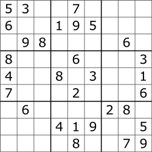
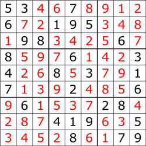

# CC3001 2023-1 - Tarea 3: Resolucion de Sudoku por backtracking

En esta tarea debe implementar un algoritmo que resuelva un sudoku usando backtracking.

## El problema del Sudoku

El sudoku es un juego de logica y numeros que consiste en rellenar un tablero de 9 x 9 con digitos del 1 al 9. Para ganar el juego hay que ubicar los digitos de manera que cada fila, columna y caja de 3 x 3 contenga todos los digitos del 1 al 9, sin repetir ninguno.





## La tarea

Debe escribir un programa que encuentre la solucion de un tablero arbitrario de Sudoku. El estado inicial del tablero se lee desde un archivo de texto que contiene 9 lineas, con 9 digitos separados por espacios. Los ceros representan casillas en blanco.

Luego de leer el estado inicial del juego y guardarlo en una matriz, el programa debe encontrar por prueba y error la forma correcta de rellenar los ceros.

## Archivos de prueba

Los archivos de prueba estan disponibles localmente en el directorio `data/`:

- `data/sudoku1.txt` a `data/sudoku7.txt`: tableros iniciales.
- `data/solsudoku1.txt` a `data/solsudoku7.txt`: soluciones esperadas.

Puede abrirlos con rutas como `data/sudoku1.txt`.

## Codigo base

El archivo `CC3001_otoño_2023_tarea3.py` contiene una funcion auxiliar para leer matrices:

```python
import numpy as np

def leer_matriz(archivo):
    f = open(archivo, "r")
    M = np.zeros((9, 9), dtype=int)
    for i in range(0, 9):
        linea = f.readline()
        b = linea.split()
        for j in range(0, 9):
            M[i, j] = int(b[j])
    return M
```

Debe implementar la funcion `pruebaSudoku(M)`. La funcion recibe una matriz con el estado inicial de un sudoku y debe completarla, modificando la misma matriz, hasta solucionar el problema.

La estrategia requerida es backtracking: para cada celda en blanco, representada por un `0`, se prueba un valor posible y se continua recursivamente. Si ese valor permite solucionar el tablero, la funcion retorna exito. Si no, se prueba otro valor hasta obtener una solucion o agotar las posibilidades.

Puede crear todas las funciones auxiliares que requiera.

Para programar la solucion debe usar arrays de NumPy. Los unicos metodos de objetos tipo array que puede utilizar en su solucion son:

- `array`, para crear un arreglo.
- `zeros` y `ones`, para inicializar un array.
- `copy`, para copiar valores.
- El operador de slice `[start:end]`, para obtener un slice.

## Funcion a implementar

```python
def pruebaSudoku(M):
    return
```

## Verificacion esperada

Con `pruebaSudoku` implementada, el siguiente programa debe pasar todos los tests:

```python
for i in range(1, 8):
    sinSolucion = "data/sudoku" + str(i) + ".txt"
    conSolucion = "data/solsudoku" + str(i) + ".txt"
    A = leer_matriz(sinSolucion)
    print("Probando solucion para " + sinSolucion + ":")
    print(A)
    B = leer_matriz(conSolucion)
    print(" ")
    print("La solucion correcta es:")
    print(B)
    print(" ")
    pruebaSudoku(A)
    print(A == B)
    print(" ")
    assert np.array_equal(A, B)
print("Su funcion paso todos los tests")
```
