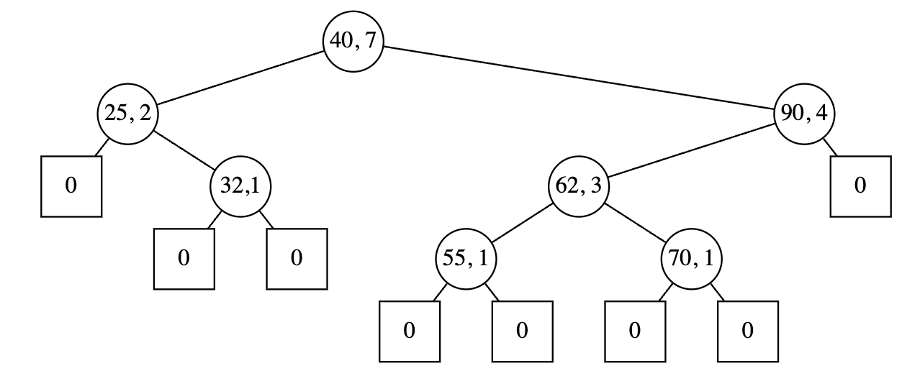

# CC3001 Otoño 2023 Tarea 5

## ABBs posicionales

```python
import aed_utilities as aed
import numpy as np
```

## Introducción

Un *árbol de búsqueda binaria posicional* (*ABB posicional*) es un ABB modificado para que en cada nodo se agregue un campo adicional, que es un contador del número de llaves que hay en el subárbol que tiene a ese nodo como raíz, como se ve en el siguiente ejemplo:



Con esta información adicional, es posible, dado un valor de $k$, encontrar rápidamente el que sería el $k$-ésimo elemento, en un recorrido en inorden de izquierda a derecha ($k=1,\ldots,n$, donde $n$ es el número de llaves del árbol). Por ser un ABB, esto es lo mismo que encontrar el $k$-ésimo menor elemento del conjunto.

Llamaremos a esta operación ``find(k)``, la cual al ser ejecutada retorna un puntero al $k$-ésimo nodo interno, de izquierda a derecha. Si $k$ está fuera del rango $[1..n]$ se debe retornar ``None``.

Para implementar esta operación, comenzamos en la raíz y miramos el contador del hijo izquierdo. Si éste es mayor o igual que $k$, entonces el $k$-ésimo debe estar en el subárbol izquierdo, y lo seguimos buscando ahí recursivamente. Si $k$ es exactamente 1 más que el contador del hijo izquierdo, el elemento buscado es la raíz, así que retornamos un puntero a él. Por último, si no ha sido ninguno de los casos anteriores, el $k$-ésimo debe estar en el subárbol derecho, así que seguimos buscando ahí recursivamente. Pero, dentro de ese subárbol, el elemento buscado ya no es el $k$-ésimo, hay que restarle al $k$ una cantidad (¿cuánto?). Por ejemplo, si estábamos originalmente buscando el elemento con $k=5$, el que sería la llave "$62$", una vez que vamos a buscarlo dentro del subárbol derecho, dentro de ese árbol es el elemento con $k=2$.

## Objetivo de la tarea

Su trabajo consiste en implementar las clases ``Arbol``, ``Nodoi`` y ``Nodoe`` y los métodos ``insert``, ``search`` y ``find`` en todos lugares en donde corresponda (no se pide implementar ``delete``). Luego debe ejecutar los casos de prueba que se indica.

Note que la operación ``insert``, además de agregar la llave que se indica, debe modificar los contadores que sea necesario para que éstos reflejen correctamente los tamaños de los subárboles respectivos.

Esta tarea se puede resolver con recursividad o sin recursividad. Usted debe decidir cuál enfoque usar.

En el código que aparece a continuación usted debe agregar todo lo necesario para que la implementación esté completa.

_Nota_: El campo "``rep``" contiene la representación visual del nodo, que va a aparecer cuando se dibuje.

```python
class Nodoi:
    def __init__(self, izq, info, contador, der):
        self.izq=izq
        self.info=info
        self.contador=contador
        self.der=der
        self.rep = str(info)+ ',' + str(contador)

class Nodoe:
    def __init__(self,contador):
        self.contador=contador
        self.rep=contador

class Arbol:
    def __init__(self,raiz=Nodoe(0)):
        self.raiz=raiz

    def dibujar(self):
      btd = aed.BinaryTreeDrawer(fieldData="rep", fieldLeft="izq", fieldRight="der", classNone=Nodoe)
      btd.draw_tree(self, "raiz")
```

Las siguientes funciones son útiles para probar su implementación:

```python
def test_search(a,x):
    print(x, "está" if a.search(x) is not None else "no está")
def test_find(a,k):
    p=a.find(k)
    print("La k-ésima llave para k=",k, "es", p.info if p is not None else "fuera de rango")
```

## Prueba: Construir un árbol por inserciones sucesivas

```python
a=Arbol()
a.insert(40)
a.insert(25)
a.insert(32)
a.insert(90)
a.insert(62)
a.insert(55)
a.insert(70)
a.dibujar()
test_search(a,62)
test_search(a,10)
test_find(a,5)
test_find(a,8)
```

## Producto esperado

Un documento markdown y un documento .py con las respuestas
